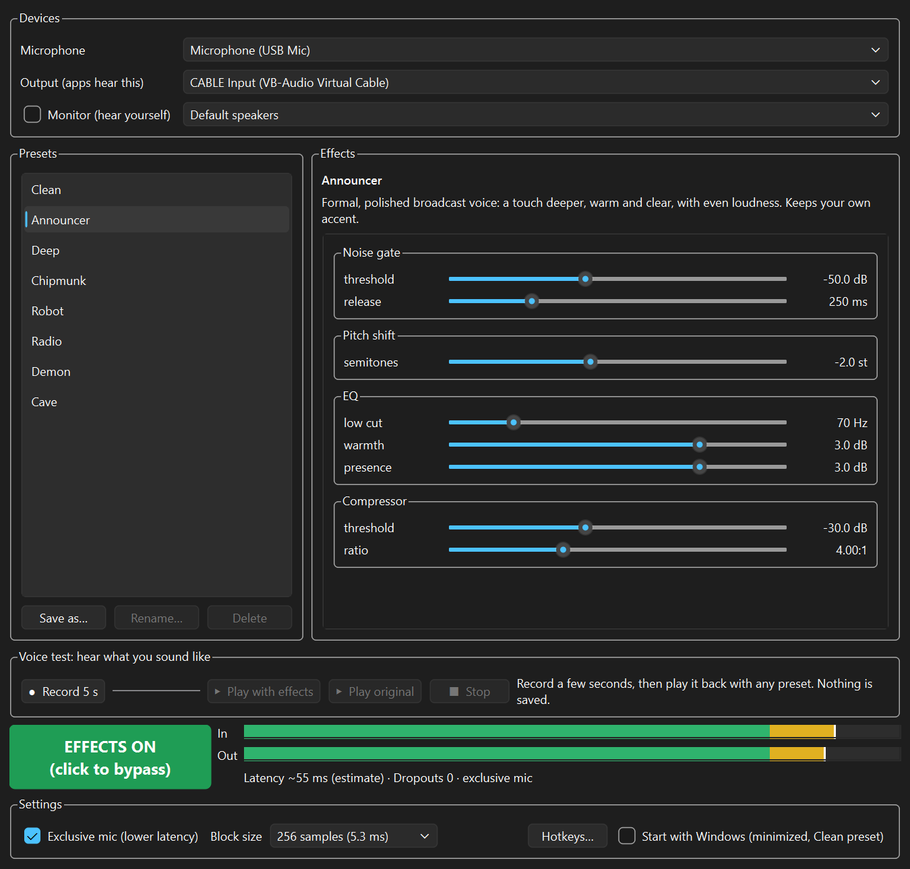

# Timbrel

A free, open-source real-time voice changer for Windows, for games and online meetings.

Timbrel takes your microphone, applies voice effects, and sends the result to a virtual microphone. Discord, Steam, in-game chat, Zoom, Teams and Google Meet hear it as a normal mic.



- **8 built-in presets:** Clean, Announcer, Deep, Chipmunk, Robot, Radio, Demon, Cave. Tweak any of them with sliders and save your own.
- **Clean preset for meetings:** your real voice, just clearer (noise gate, rumble cut, a little presence, gentle compression). Good to leave on all day.
- **Global hotkeys:** F9 bypass, F10/F11 previous/next preset. They work in full-screen games.
- **Instant, click-free bypass:** drop back to your real voice mid-sentence.
- **Voice test:** record a few seconds and play them back through any preset.
- **Monitor:** hear yourself live in your headphones.
- Runs in the tray, uses about 1-2% of one CPU core, and needs no GPU.

## Download and install

1. **Install VB-Audio Virtual Cable (free).** Download it from <https://vb-audio.com/Cable/>, run `VBCABLE_Setup_x64.exe` **as administrator**, then restart your PC. It creates two devices: **CABLE Input** (Timbrel plays into it) and **CABLE Output** (your apps use it as their microphone). Timbrel doesn't include VB-Cable; it's a separate donationware product from VB-Audio.
2. **Download Timbrel** from the [Releases page](../../releases): get `Timbrel-vX.Y.Z-win64.zip`, unzip it anywhere, and run `Timbrel.exe`.
3. **Windows SmartScreen** may say "Windows protected your PC", because the app isn't code-signed yet. Click **More info → Run anyway**.
4. In Timbrel, pick your real microphone under **Microphone**. **Output** should already be *CABLE Input (VB-Audio Virtual Cable)*.

Installing VB-Cable sometimes makes *CABLE Output* your Windows default microphone. That's fine for Timbrel, which always asks for your real mic, but you may want to set your real mic back as the default in Windows Sound settings for other apps.

## Set up your apps

In each app, choose **CABLE Output (VB-Audio Virtual Cable)** as the microphone.

| App | Where |
| --- | --- |
| **Discord** | User Settings → Voice & Video → Input Device. Turn off **Krisp** noise suppression if it muffles the effects. |
| **Zoom** | Settings → Audio → Microphone. If effects sound choppy, lower "Suppress background noise" or enable "Original sound for musicians". |
| **Microsoft Teams** | Settings → Devices → Microphone. Lower Noise suppression if effects get mangled. |
| **Google Meet** (browser) | Settings → Audio → Microphone. Allow mic access in the browser; turn off Meet's noise cancellation if needed. |
| **Slack huddles / Webex** | Pick "CABLE Output" as the microphone in audio settings. |
| **Steam / in-game voice** | Set the voice input device to "CABLE Output". |

Meeting apps' own noise suppression can make the Robot and Radio effects sound choppy; lower it if that happens.

## Using Timbrel

- **Presets:** click one to switch; switching crossfades, so there are no clicks. Move the sliders to adjust, then **Save as…** to keep your version. Built-in presets can't be renamed or deleted; your own can.
- **Bypass:** the big button (or **F9**) switches between effects and your real voice instantly. The button, window title and tray icon always show the state: a green wave means effects are ON, a grey slashed icon means BYPASSED.
- **Voice test:** **Record 5 s**, then **Play with effects** (try different presets on the same clip) or **Play original**. Playback goes to your monitor device or speakers, and apps hear silence from Timbrel while it plays. Nothing is saved to disk.
- **Monitor:** tick it and choose your headphones to hear yourself live. Use headphones, or speakers will feed back into the mic.
- **Closing the window** keeps Timbrel running in the tray. Right-click the tray icon for Bypass, Presets and Quit. Starting Timbrel again brings up the running window.

### Hotkeys

| Key | Action |
| --- | --- |
| F9 | Bypass on/off |
| F10 | Previous preset |
| F11 | Next preset |

Change them under **Settings → Hotkeys…**. The keys still reach your game. Hotkeys can't see key presses while a game runs as administrator, unless Timbrel is also run as administrator.

### Settings

- **Exclusive mic (lower latency):** opens your mic exclusively, which saves about 18 ms of delay; other apps can't use the mic directly while Timbrel runs. If the mic is busy, Timbrel falls back to shared mode automatically.
- **Block size:** 256 is the default. Raise it if you hear crackles; lower it to shave a few ms.
- **Start with Windows:** starts minimized to the tray with the Clean preset.

Settings and your presets are stored in `%APPDATA%\Timbrel`.

## Troubleshooting

- **Nobody hears me:** check that the app's microphone is **CABLE Output**, that Timbrel's Output is **CABLE Input**, and that the In meter moves when you talk. If the Out meter stays empty in silence, that's the noise gate doing its job.
- **"Audio paused" banner:** a device was unplugged or is being used exclusively by another app. Timbrel keeps checking and resumes by itself when the device is back.
- **Crackles or dropouts:** raise the block size to 512, close other audio-heavy apps, and keep the **Dropouts** counter at 0.
- **Effects sound choppy in calls:** turn down the call app's noise suppression (Krisp, Zoom, Teams, Meet).
- **Hotkeys don't work in one game:** the game probably runs as administrator; run Timbrel as administrator too.
- **Delay:** Timbrel plus VB-Cable adds roughly 55-80 ms, depending on settings and whether pitch shift is on. The readout in the window is Windows' estimate.
- **Voices and rules:** some games and communities don't allow voice changers. Check the rules before using one.

## Responsible use

People in work meetings usually expect to hear your real voice, and some workplaces restrict audio modification. Use the Clean preset there, or ask first. Don't use voice effects to impersonate other people, or to hide your identity where that's expected.

## Run from source

Requires Windows 10/11 and Python 3.11+.

```powershell
py -3.12 -m venv .venv
.\.venv\Scripts\python -m pip install -e ".[dev]"
.\.venv\Scripts\python -m timbrel                    # the app
.\.venv\Scripts\python -m timbrel --list-devices     # audio devices
.\.venv\Scripts\python -m timbrel --no-gui --effect pitch:semitones=-4   # terminal mode
```

See [CONTRIBUTING.md](CONTRIBUTING.md) for tests, code style and how to add an effect.

## License

Timbrel is [MIT licensed](LICENSE). It uses third-party libraries under their own licenses; see [THIRD_PARTY_NOTICES.md](THIRD_PARTY_NOTICES.md).
